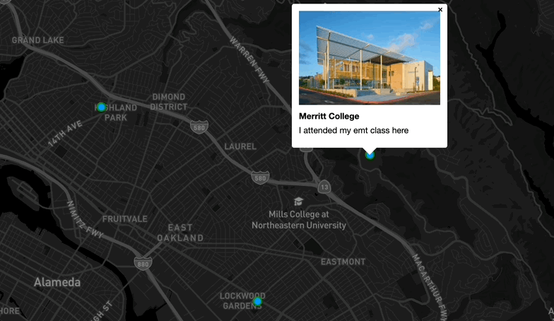

# "My Summer Internships" Map

## What did I build?

["My Summer Internships" Map] Is a map that is showing Bay Area and the locations I took internships during the summer

Users can...
1. **Toggle through the maps**, 
   By clikcing the little blue dots on the map
2. **Explore each location** When they click. the dots a picture and a description of the place will show up
3. **See detailed itineraties** The map includes the ability to zoom in and out. This way you can find out specifcally

Here's a demo:

## Why did I make this?
This is a fun way for people to  learn how to do things online especially for those who are visual learners. This map shows the summer internship I've participated in which show who I am by what I like to domin my free time during the summer.
 

I set these goals for my product:

1. I wanted images to be on the pop ups so people can see the location
2. I wanted the map to centered in the Bay Area where you can see all three points

## Tech stack

To build this app, I used the following tools:

1. [Google My Maps](https://www.google.com/maps/d/u/0/), To get the coordinated of my city so the map is centered on Oakland and the places on the map I chose for clear visual and easy access

2. [Mapbox GL JS](https://docs.mapbox.com/mapbox-gl-js/guides) I used Mapbox
3. [Visual Studio Code](https://code.visualstudio.com/download) free IDE, with [Live Server](https://marketplace.visualstudio.com/items?itemName=ritwickdey.LiveServer) and [Markdown All in One](https://marketplace.visualstudio.com/items?itemName=yzhang.markdown-all-in-one) extensions.
4. [GitHub pages](https://docs.github.com/en/pages/getting-started-with-github-pages/creating-a-github-pages-site), for publishing the app for free!

## Feature Spotlight

One key feature I want to spotlight is The color of the dots on the map

If you look closely at the map, The dots are light blue which is one of my favorite colors therefore, they are clear to see for everyone since the map theme is dark

Check it out: 

## Contributions

Feel free to copy the code if you want it! Comments are welcome on [this blog post](https://domlet.github.io/posts/bike-the-bay/).
